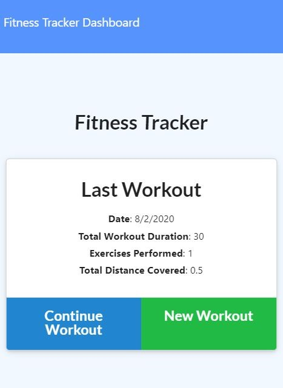

# [fitness-tracker](https://secret-scrubland-53219.herokuapp.com/)
      

## Getting Started

This web application allows a user to record workout exercises they've performed and track their workout data graphically.

## Installation

Visit the [web site](https://fathomless-sands-66286.herokuapp.com/)

## Usage

Create a new workout:  On the home page click the green button.
Add exercise to workout:  Select exercise type and enter the details of the exercise.  Then click the green button.
Complete the workout:  Click the blue button.

View your workout data by clicking the Dashboard link in the header.

## Concepts within

- MongoDB
- Mongoose
- Chart.js
- express
- Javascript
- jQuery

## Credits

- [Trilogy](https://www.trilogyed.com/)
- [npm express](https://www.npmjs.com/package/express)
- [Chart.js](https://www.chartjs.org/)
- [MongoDB0](https://www.mongodb.com/)
- [Mongoose](https://mongoosejs.com/)
- [jQuery](https://jquery.com/)

## License

Copyright (c) 2020 Jesse Mazur

Permission is hereby granted, free of charge, to any person obtaining a copy
of this software and associated documentation files (the "Software"), to deal
in the Software without restriction, including without limitation the rights
to use, copy, modify, merge, publish, distribute, sublicense, and/or sell
copies of the Software, and to permit persons to whom the Software is
furnished to do so, subject to the following conditions:

The above copyright notice and this permission notice shall be included in all
copies or substantial portions of the Software.

THE SOFTWARE IS PROVIDED "AS IS", WITHOUT WARRANTY OF ANY KIND, EXPRESS OR
IMPLIED, INCLUDING BUT NOT LIMITED TO THE WARRANTIES OF MERCHANTABILITY,
FITNESS FOR A PARTICULAR PURPOSE AND NONINFRINGEMENT. IN NO EVENT SHALL THE
AUTHORS OR COPYRIGHT HOLDERS BE LIABLE FOR ANY CLAIM, DAMAGES OR OTHER
LIABILITY, WHETHER IN AN ACTION OF CONTRACT, TORT OR OTHERWISE, ARISING FROM,
OUT OF OR IN CONNECTION WITH THE SOFTWARE OR THE USE OR OTHER DEALINGS IN THE
SOFTWARE.

## Contributing

Post comments or issues on the repo.

